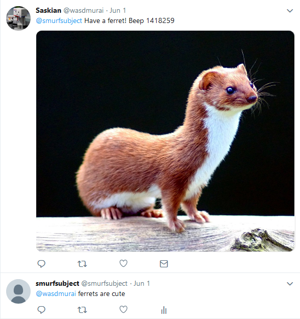

A twitter bot that replies with contextually appropiate images. It will establish a connection to the twitter
streaming API and trigger the on_data event when it gets a mention. 

Dependencies
-------

Tweepy - https://github.com/tweepy/tweepy

Setup
-----

Put twitter [compliant
images](https://developer.twitter.com/en/docs/media/upload-media/uploading-media/media-best-practices)
in `/images` and put the image tags in `keywords.json`. The json
format should be

    "images/FILENAME": ["TAG1", "TAG2", ...]

The tags are optional. An empty list (`[]`) is OK. They can be
generated using [this tool](https://github.com/Bluebottel/imgtagger).

Usage
---

`python main.py authfile @username`

The authfile should contain the twitter API keys in the following order:

consumer_key\
consumer_token\
access_token\
access_token_secret

They are generated on your twitter dashboard > apps > your_app > keys and tokens. The @username can be
anything really as long as it's accepted by the twitter API as a valid search request.

If the person tweeting the bot mentions more than one keyword one of
them will be chosen at random to return an image of.

Docker
------

Build with `docker build -r --tag=tbot .` (note the dot at the end) and
run with `docker run tbot`

Preview
----

Troubleshooting
--------

Twitter doesn't really like bots doing whatever they want in general so many replies will
go missing for no apparent reason. It helps if the mentioner is following you and, if that also fails,
persistence.

Another thing to keep in mind is the rate limits put in place twitter. See their documentation [here](https://developer.twitter.com/en/docs/basics/rate-limits.html).
